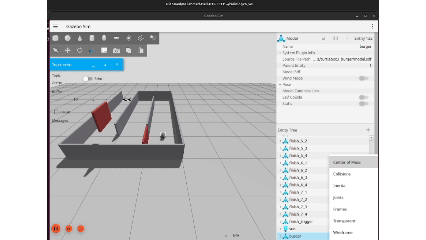
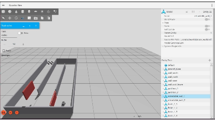

# Maze Control — Quick Setup

Get the maze simulation built and running. Assumes you already have **ROS 2
Jazzy** installed on **Ubuntu 24.04**.

---

## 1. Install Gazebo Harmonic + the ROS↔GZ bridge

```bash
sudo apt update
sudo apt install -y ros-jazzy-ros-gz
```

Verify:

```bash
gz sim --version
```

You should see Gazebo Sim, version 8.x (Harmonic).

---

## 2. Get the package into a workspace

```bash
mkdir -p ~/training_ws/src
cd ~/training_ws/src
git clone https://github.com/eng-Aly/MIA26_phase2_ros_contest.git     
```


## 3. TurtleBot3 Burger support 

this is the robot that being spawned in the simulation so it's important to verify this step worked correctly

```bash
sudo apt install -y ros-jazzy-turtlebot3-gazebo ros-jazzy-turtlebot3-msgs ros-jazzy-turtlebot3
```

Verify it's installed correctly

```bash
ros2 pkg prefix turtlebot3_gazebo
```

Should print `/opt/ros/jazzy`.

---

## 5. Build

```bash
cd ~/training_ws
colcon build 
source install/setup.bash
```

Add that `source` line to your `~/.bashrc` if you don't want to repeat it
every terminal:

```bash
echo "source ~/training_ws/install/setup.bash" >> ~/.bashrc
```

---

## 6. Run it


**TurtleBot3 Burger** :

```bash
ros2 launch maze_control maze_simulation_tb3.launch.py
```

Gazebo should open with the maze, the robot sitting at the start.
your output should look like this



---

## 7. Solve it 

your target is to make the robot reach the end line using actions and
services — full details in the [challenge brief](assets/challenge_brief).

**note: red walls can move based on services find how to do so**




